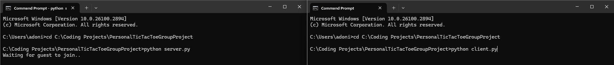
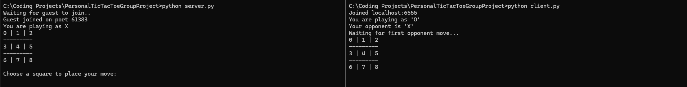
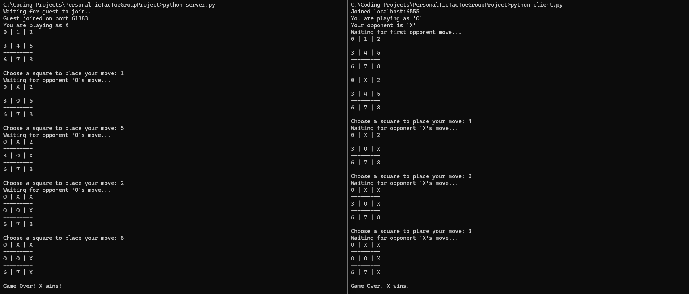

# PersonalTicTacToeGroupProject // Python Socket Project (Tic-Tac-Toe)

Note: 
Group project to understand python sockets for a computer networking course.
Team consisted of 4 people including me and included building, keeping a progress log, and a final presentation.

Project Details:
Uses Python sockets to connect two clients establishing one as 'x'and one as 'o'.
Each client takes turns by typing a number from 0-9 to establish their position they want on the board 
Game logic check for wrong inputs and also decides a winner, loser, or tie game 

How to run:
Open two terminals.
CD into the project folder directory 

In one, run: "python server.py" for  server.
In the other, run: "python client.py" for client.

game has been established 

Pictures:

